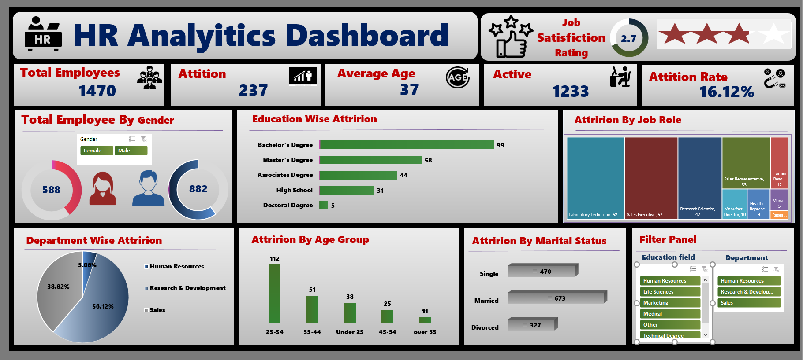

# HR Analytics Dashboard (Excel)

## Overview
این پروژه یک داشبورد تعاملی HR Analytics در اکسل است که بر اساس داده‌های کارکنان (از Kaggle HR Analytics Dataset) ساخته شده. هدف: تحلیل نرخ attrition (۱۶.۱۲٪)، رضایت شغلی (میانگین ۲.۷ از ۵)، و توزیع demographics مثل جنسیت (۵۸۸ زن، ۸۸۲ مرد)، سن (میانگین ۳۷)، و آموزش.

**KPIهای کلیدی:**
- کل کارکنان: ۱۴۷۰
- Attrition: ۲۳۷ نفر (۱۶.۱۲٪)
- رضایت شغلی: ۲.۷ ستاره
- متوسط سن: ۳۷ سال
- فعال: ۱۲۳۳ نفر

## Features داشبورد
- **فیلترها:** بر اساس دپارتمان (Sales, R&D, HR)، آموزش، و وضعیت تأهل.
- **نمودارها:** Pie برای توزیع جنسیت/دپارتمان، Bar برای attrition by education/job role/age group/marital status.
- **Insights:** 
  - بیشترین attrition در Sales (۵۶.۱۲٪ از کل attrition).
  - Bachelorها بیشترین خروج (۹۹ نفر).
  - افراد ۲۵-۳۴ ساله پرریسک‌ترین گروه سنی (۵۱ خروج).
  - متأهل‌ها کمتر attrition دارن (۳۲٪ از کل).

## چطور داشبورد رو باز کنی
1. فایل [HR_Analytics_Dashboard.xlsx](HR_Analytics_Dashboard.xlsx) رو دانلود کن.
2. در Excel باز کن (PivotTables و Slicers فعال باشن).
3. فیلترها رو تست کن (مثل انتخاب "Sales" در دپارتمان).

## داده‌ها
- منبع: [Kaggle HR Analytics Employee Attrition](https://www.kaggle.com/datasets/pavansubhasht/ibm-hr-analytics-attrition-dataset) (۱۴۷۰ رکورد).
- ستون‌های کلیدی: Age, Gender, Education, Department, JobRole, MaritalStatus, JobSatisfaction, Attrition.

## ابزارها و مهارت‌ها
- **Excel:** PivotTables, Charts, Slicers, Conditional Formatting.
- **تحلیل:** EDA با فرمول‌ها (AVERAGE, COUNTIF)، و visualization.
- **پیشنهادها:** برای کاهش attrition، برنامه‌های آموزشی برای Bachelorها و تمرکز روی Sales (مثل افزایش رضایت با ۱۰٪).

## چطور ساختم؟
1. داده خام رو import کردم به Excel.
2. PivotTables برای aggregation ساختم.
3. Charts اضافه کردم و Slicers برای interactivity.
4. Insights رو با فرمول‌ها حساب کردم (مثل Attrition Rate = COUNTIF(Attrition="Yes") / Total).

## License
MIT License – آزاد برای استفاده.

**تماس:**  ra3tkar@gmail.com

---

*به‌روزرسانی: دسامبر ۲۰۲۵*
